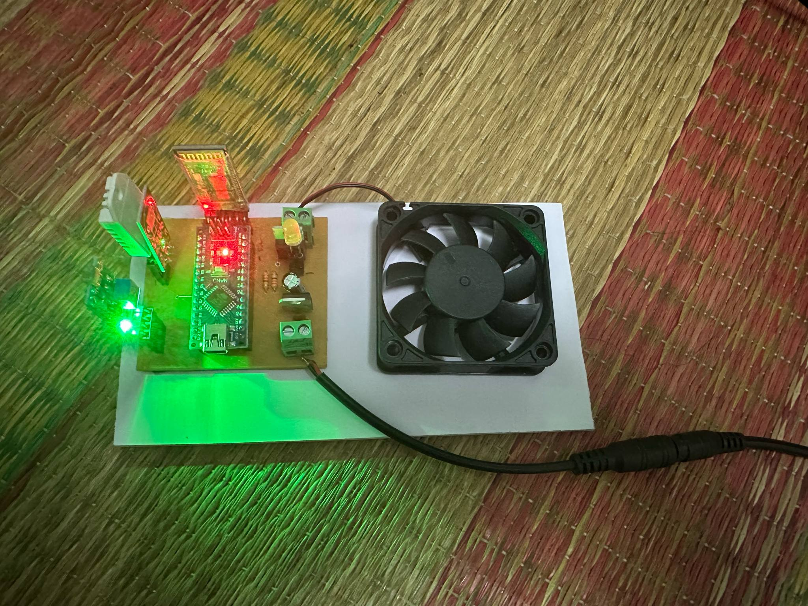
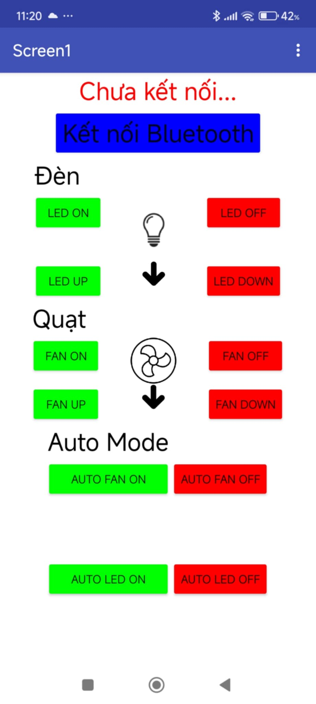
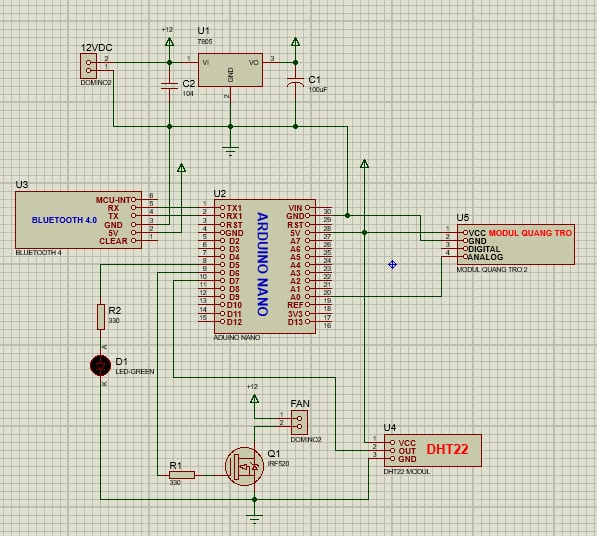

# Smart Fan & Light Control System

##  Giới thiệu
Dự án điều khiển **đèn LED** và **quạt** thông qua **Bluetooth** hoặc chế độ **tự động**, sử dụng **Arduino Nano**.  
Hệ thống có thể tự bật/tắt đèn và quạt dựa trên **nhiệt độ** và **độ sáng môi trường**.
Hệ thống có thể điều khiển thiết bị bằng giọng nói, điều khiển qua MIT APP INVENTOR.
---

##  Chức năng chính
- **Điều khiển thủ công** qua Bluetooth (bật/tắt, tăng/giảm).
- **Chế độ tự động** dựa trên ngưỡng nhiệt độ và ánh sáng cài đặt.
- Hiển thị giá trị cảm biến lên Serial Monitor.
- Điều khiển mượt mà nhờ **PWM**.

---

##  Phần cứng sử dụng
- Arduino Nano  
- Module Bluetooth HC-05  
- Cảm biến nhiệt độ & độ ẩm DHT22  
- Cảm biến quang trở (LDR)  
- Quạt DC  
- Đèn LED  
- Module relay / transistor điều khiển tải

---

##  Kỹ thuật & Công nghệ
- **Ngôn ngữ:** C/C++ (Arduino)  
- **IDE:** Arduino IDE  
- **Giao tiếp:** UART với HC-05  
- **Điều khiển:** PWM cho LED/quạt  
- **Xử lý dữ liệu:** đọc & xử lý giá trị từ cảm biến DHT22 và LDR  

---

##  Hình ảnh dự án
 
 
 
 
---

##  Video demo
[![Video Demo]](https://drive.google.com/drive/u/3/folders/1f1YwoMJC-NRLgKDCreqJtoRBvU9ys58_)

---

##  Cách sử dụng
1. Nạp code `.ino` vào Arduino Nano qua Arduino IDE.
2. Kết nối module Bluetooth HC-05 với điện thoại.
3. Sử dụng ứng dụng Bluetooth (VD: Bluetooth Terminal hoặc app custom) để gửi lệnh.
4. Chuyển sang chế độ auto/manual tùy nhu cầu.

---

